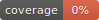

# bethowen.ru Parser

get creds/cookies/headers ->
    parse categories ->
        parse sub categories ->
            parse section ->
                parse products ->
                    store products